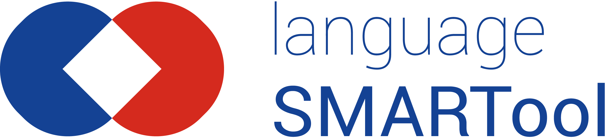

# SMARTool for Min russiske reise

- https://smartool.github.io/min-russiske-reise/

## Dependencies and terms of use

- The code (JS and HTML) is licensed under the
  [GNU Affero General Public License](https://www.gnu.org/licenses/agpl-3.0.en.html)
  (except PapaParse which uses MIT license).
- Uses https://www.papaparse.com/#remote-files to fetch [CSV data](https://github.com/smartool/data-rus-eng).
- Uses https://responsivevoice.org/api/ to convert text to speech (**commercial use is not allowed**).

## About

This is a version of https://github.com/smartool/smartool-rus-eng with a lesson
selection instead of a level selection. Please see
https://github.com/smartool/smartool-rus-eng for more information about the
project and the people behind this project.
